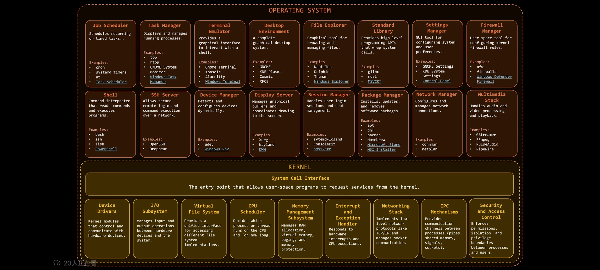

# Unix/Linux 系统架构概览

> 本文档整理了 Unix/Linux 操作系统的整体架构，分为**用户空间（User Space）** 和 **内核空间（Kernel Space）** 两大层次。

---

## 一、整体架构图



---

## 二、用户空间 (User Space) / 操作系统层

用户空间包含与用户交互的各种应用程序和系统服务。

### 2.1 任务调度与进程管理

| 组件 | 功能描述 | 示例 |
|------|----------|------|
| **Job Scheduler** | 调度周期性或定时任务 | `cron`, `systemd timers`, `at` |
| **Task Manager** | 显示和管理运行中的进程 | `top`, `htop`, `GNOME System Monitor` |

**学习要点：**
- `cron` 用于定时任务，编辑命令 `crontab -e`
- `top` / `htop` 实时查看系统资源使用情况

---

### 2.2 终端与 Shell

| 组件 | 功能描述 | 示例 |
|------|----------|------|
| **Terminal Emulator** | 提供与 Shell 交互的图形界面 | `GNOME Terminal`, `Konsole`, `Alacritty`, `iTerm2` |
| **Shell** | 命令解释器，读取并执行命令 | `bash`, `zsh`, `fish` |

**学习要点：**
- Shell 是用户与内核交互的桥梁
- 常用 Shell：bash（默认）、zsh（功能丰富）、fish（友好易用）

---

### 2.3 桌面与文件管理

| 组件 | 功能描述 | 示例 |
|------|----------|------|
| **Desktop Environment** | 完整的图形桌面系统 | `GNOME`, `KDE Plasma`, `XFCE` |
| **File Explorer** | 图形化文件浏览和管理工具 | `Nautilus`, `Dolphin`, `Thunar` |

---

### 2.4 开发工具与系统服务

| 组件 | 功能描述 | 示例 |
|------|----------|------|
| **Standard Library** | 提供高级编程 API | `glibc`, `musl` |
| **SSH Server** | 安全的远程登录和命令执行 | `OpenSSH`, `Dropbear` |
| **Package Manager** | 安装、更新、卸载软件包 | `apt`, `dnf`, `pacman`, `Homebrew` |
| **Settings Manager** | 系统和用户偏好设置 GUI | `GNOME Settings`, `KDE System Settings` |
| **Firewall Manager** | 防火墙规则配置 | `ufw`, `firewalld` |

---

### 2.5 硬件与多媒体

| 组件 | 功能描述 | 示例 |
|------|----------|------|
| **Device Manager** | 检测和配置硬件设备 | `udev` |
| **Display Server** | 管理图形缓冲区和屏幕绘制 | `Xorg`, `Wayland` |
| **Multimedia Stack** | 音频视频处理和播放 | `GStreamer`, `FFmpeg`, `PulseAudio` |

---

## 三、系统调用接口 (System Call Interface)

**系统调用**是用户空间程序请求内核服务的入口点。

- 用户程序通过系统调用从用户态切换到内核态
- 常见系统调用：`open()`, `read()`, `write()`, `fork()`, `exec()`, `exit()`

---

## 四、内核空间 (Kernel Space)

内核是操作系统的核心，直接与硬件交互。

### 4.1 设备与 I/O 管理

| 子系统 | 功能描述 |
|--------|----------|
| **Device Drivers** | 控制硬件设备的内核模块 |
| **I/O Subsystem** | 管理硬件与系统间的输入输出操作 |

---

### 4.2 文件系统与存储

| 子系统 | 功能描述 |
|--------|----------|
| **Virtual File System** | 统一接口访问不同文件系统实现 |
| **Memory Management** | 管理 RAM、虚拟内存、分页、内存保护 |

**学习要点：**
- VFS 抽象了 ext4、XFS、NTFS 等不同文件系统
- 虚拟内存让程序认为自己拥有连续的大内存

---

### 4.3 CPU 与进程调度

| 子系统 | 功能描述 |
|--------|----------|
| **CPU Scheduler** | 决定哪个进程/线程在 CPU 上运行及运行时长 |

**学习要点：**
- 调度算法：CFS（完全公平调度器）
- 进程状态：运行、就绪、阻塞、僵尸

---

### 4.4 中断与异常处理

| 子系统 | 功能描述 |
|--------|----------|
| **Interrupt & Exception Handler** | 响应硬件中断和 CPU 异常 |

---

### 4.5 网络与通信

| 子系统 | 功能描述 |
|--------|----------|
| **Networking Stack** | 实现 TCP/IP 等协议，管理 Socket 通信 |
| **IPC Mechanisms** | 进程间通信：管道、共享内存、信号、Socket |

**学习要点：**
- TCP/IP 协议栈在内核中实现
- IPC 方式：管道（`|`）、信号（`kill`）、共享内存

---

### 4.6 安全与权限

| 子系统 | 功能描述 |
|--------|----------|
| **Security & Access Control** | 权限控制、进程隔离、用户特权边界 |

**学习要点：**
- 文件权限：`rwx`（读、写、执行）
- 用户/组权限管理：`chmod`, `chown`

---

## 五、学习总结

### 5.1 层次关系

```
应用程序 (vim, chrome, lazygit...)
        ↓
    Shell (bash/zsh)
        ↓
 系统调用接口 (syscall)
        ↓
    内核 (Kernel)
        ↓
    硬件 (CPU, Memory, Disk...)
```

### 5.2 关键概念

| 概念 | 说明 |
|------|------|
| **用户态 vs 内核态** | 用户程序运行在用户态，受限访问；系统调用进入内核态，完整权限 |
| **进程 vs 线程** | 进程是资源分配单位，线程是执行单位 |
| **文件描述符** | 内核用于访问文件的抽象句柄 |
| **Shell 脚本** | 自动化执行命令序列 |

---

## 六、参考资料

- 《Unix 环境高级编程》(APUE)
- 《Linux 内核设计与实现》
- `man` 命令：Unix 自带的帮助文档

---

*创建时间：2025-03-13*  
*图片来源：Unix 系统架构图*
